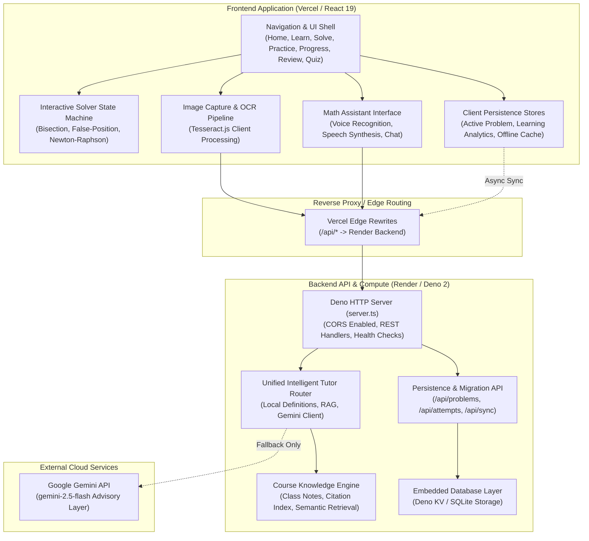
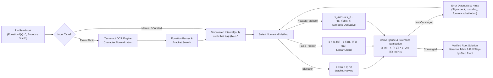
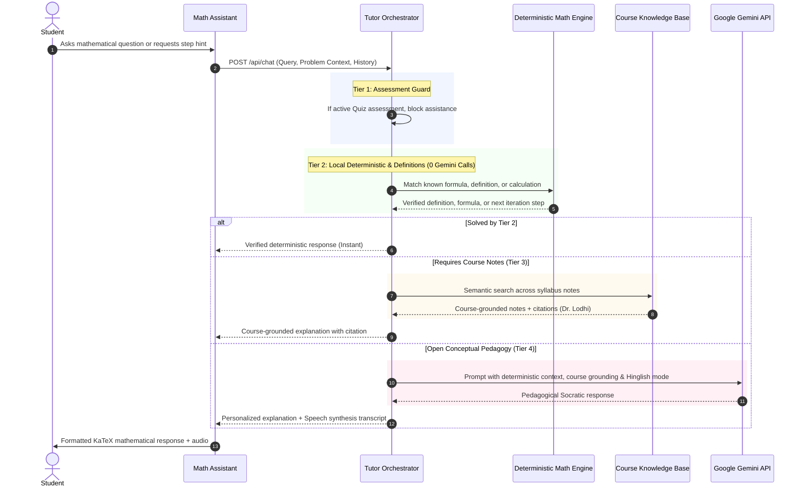

# MathEngineer

> **Deterministic Step-by-Step Engineering Mathematics Platform**  
> Designed specifically for undergraduate engineering students to master numerical techniques, root-finding algorithms, and computational methods with verified convergence, Socratic guidance, and zero hallucinations.

---

## Architecture Overview

MathEngineer employs a **deterministic-first, AI-assisted** architecture. Mathematical computations, interval convergence, bracket discovery, and step validations are executed by verifiable numerical engines. Large language models (Google Gemini) are strictly isolated as an advisory layer for conceptual pedagogy, course note grounding (RAG), and natural language voice/chat interactions.



---

## Numerical Solving & Validation Pipeline

Every problem submitted by an engineering student passes through a multi-stage deterministic pipeline. The algorithms guarantee bounded convergence according to university examination criteria.



---

## Intelligent Tutor & Grounding (RAG) Pipeline

The assistant uses a 4-tier query resolution hierarchy to maximize speed, minimize token consumption, and eliminate algorithmic hallucination:



---

## Core Modules

| Module | Route | Key Capabilities |
| :--- | :--- | :--- |
| **Home** | `/` | Course roadmap, method progress summaries, curated daily practice problem, student streak counter. |
| **Learn** | `/learn` | 10-part structured lessons for Bisection, Regula Falsi, and Newton-Raphson methods with interactive graphs. |
| **Solve** | `/solve` | Step-by-step solver with three learning modes: *"Try it myself"*, *"Guided Hints"*, and *"Show complete solution"*. Real-time arithmetic and bracketing validation. |
| **Practice** | `/practice` | 20 curated undergraduate exam-style problems across varying difficulty levels, plus side-by-side **Method Comparison** benchmark tool. |
| **Progress** | `/progress` | Quantitative mastery tracking, hint reliance analytics, recency model, and adaptive practice recommendations. |
| **Review** | `/review` | Persistent log of historical problem attempts, mistake classification (bracketing, rounding, formula substitution), and retry mechanisms. |
| **Quiz** | `/quiz` | Timed mastery assessments with randomized question configurations and objective scoring. |

---

## Technology Stack

- **Frontend**: React 19, TypeScript 5.7, Vite 6, Tailwind CSS 3.4, Lucide Icons, KaTeX (LaTeX math rendering).
- **Backend**: Deno 2 Runtime, Standalone HTTP Server (`server.ts`), Deno KV / SQLite database engine.
- **Computer Vision & OCR**: Tesseract.js (in-browser optical character recognition), automated interval discovery.
- **Mathematical Computation**: Deterministic numerical algorithms, expression parser, automated symbolic differentiator.
- **AI & RAG Engine**: Google Gemini API (`gemini-2.5-flash`), Course Knowledge Semantic Retrieval.

---

## Deployment Guide

MathEngineer is pre-configured for dual-cloud deployment:
- **Frontend**: Deployed to **Vercel** with global CDN edge caching and automated `/api/*` proxying.
- **Backend**: Deployed to **Render** as a high-performance containerized Deno web service.

```
                    ┌─────────────────────────┐
                    │  Vercel Edge Network    │
                    │  (Static React Assets)  │
                    │  https://*.vercel.app   │
                    └────────────┬────────────┘
                                 │
                    Rewrites /api/* to Render
                                 │
                                 ▼
                    ┌─────────────────────────┐
                    │  Render Web Service     │
                    │  (Deno 2 HTTP Server)   │
                    │  https://*.onrender.com │
                    └────────────┬────────────┘
                                 │
                       Reads GEMINI_API_KEY
                                 ▼
                    ┌─────────────────────────┐
                    │  Google Gemini API      │
                    └─────────────────────────┘
```

### 1. Backend Deployment on Render

1. Go to [Render Dashboard](https://dashboard.render.com/) and click **New → Web Service**.
2. Connect your GitHub repository (`Labdhimandovara/MathEngineer`).
3. Select **Docker** environment (or let Render detect `render.yaml` Blueprint):
   - **Name**: `mathengineer`
   - **Branch**: `main`
   - **Region**: Oregon (or nearest to your users)
   - **Plan**: Free (or Starter)
   - **Health Check Path**: `/api/ai-status`
4. Add the following **Environment Variables**:
   | Variable | Value | Required? | Description |
   | :--- | :--- | :--- | :--- |
   | `PORT` | `8000` | Yes | HTTP server binding port |
   | `GEMINI_API_KEY` | `your_gemini_api_key` | Optional | Powers AI Tutor and exam-photo equation parsing |
   | `DENO_TLS_CA_STORE` | `system` | Optional | Uses system certificates |
5. Click **Create Web Service**. Once deployed, Render will provide your public backend URL:  
   `https://mathengineer.onrender.com`

---

### 2. Frontend Deployment on Vercel

1. Go to [Vercel Dashboard](https://vercel.com/new) and click **Import Repository** (`Labdhimandovara/MathEngineer`).
2. Framework Preset will automatically detect **Vite**.
   - **Build Command**: `npm run build`
   - **Output Directory**: `dist`
   - **Install Command**: `npm install`
3. In `vercel.json`, ensure the proxy destination points to your Render backend:
   ```json
   {
     "rewrites": [
       {
         "source": "/api/:path*",
         "destination": "https://mathengineer.onrender.com/api/:path*"
       },
       {
         "source": "/(.*)",
         "destination": "/index.html"
       }
     ]
   }
   ```
4. Click **Deploy**. Vercel will build and launch your application with zero additional configuration needed.

---

## Local Development

### Prerequisites
- [Deno 2+](https://deno.land/) installed (recommended), or Node.js 20+.
- A Google Gemini API key (optional, for AI features).

### Getting Started

```bash
# Clone the repository
git clone https://github.com/Labdhimandovara/MathEngineer.git
cd MathEngineer

# Set up local environment variables
cp .env.example .env
# Edit .env and supply your GEMINI_API_KEY

# Start local development server (Vite + hot reloading)
deno task dev

# Run comprehensive test suite (664 automated tests)
deno task test

# Build production bundle
deno task build

# Run production backend server locally
deno task start
```

---

## Test Suite Verification

MathEngineer includes an exhaustive automated test suite covering deterministic root finding, bracketing algorithms, error classification, voice interaction robustness, course RAG grounding, and Gemini API fallbacks.

```bash
deno test -A --unstable-sloppy-imports
```
```text
ok | 664 passed | 0 failed (6s)
```

---

## License

MIT License. Designed and developed for engineering mathematics education.
